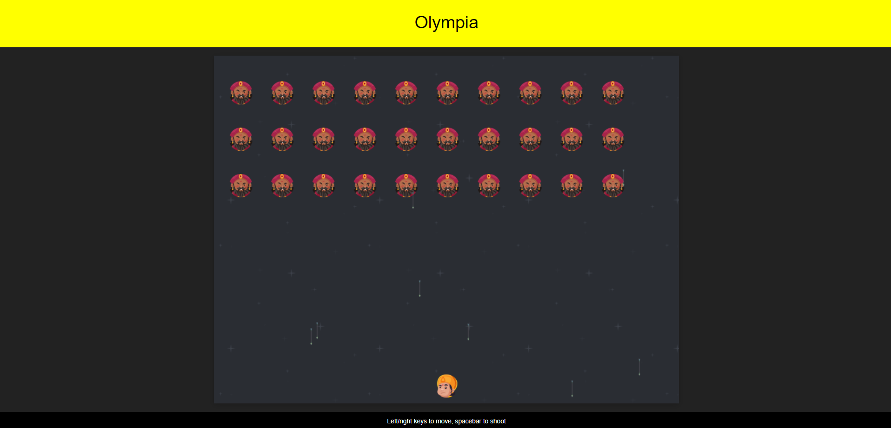
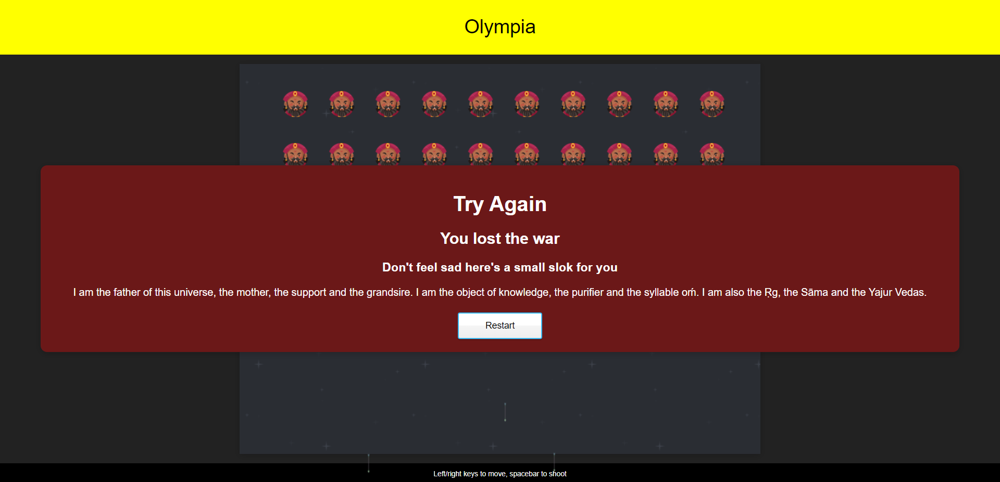

# **OLYMPIA**

### Game Hosted at:- https://awesome-kare-1a7564.netlify.app/
---
## **About the Game**

### The developers of this game wanted to bring a twist to the modern-day game Galaga by introducing the concept of Mahabharat and Indian mythology to it.

### Olympia presents a game where good triumphs over evil. Here a shooter in the form of Pandavas shoots the evil Kauravas faces. The aim is to finish all the Kauravas by aiming at them but the twist is to defend yourself from their attacks. If you fail to do so Kauravas win.

---
---

## **Instructions** 

- Use LEFT & RIGHT keys to move the shooter (DEFENCE)
- SpaceBar key to shoot the arrows (ATTACK)

---
---

## **Technolgies Used**

### 1. **Frontend** 

- JavaScript
- CSS
- Html
---
### 2. **Backend**

- Node.js
- Express 

---

## Features

- At the end of the game pop up message come.
- The pop-up message shows a quote from Bhagwat Geeta
- The game runs smoothly 
- The game is responsive 
- The game is  easily customizable (Addition of features)
- Comments are provided in the code for easy understanding 

## Game-Play Images

